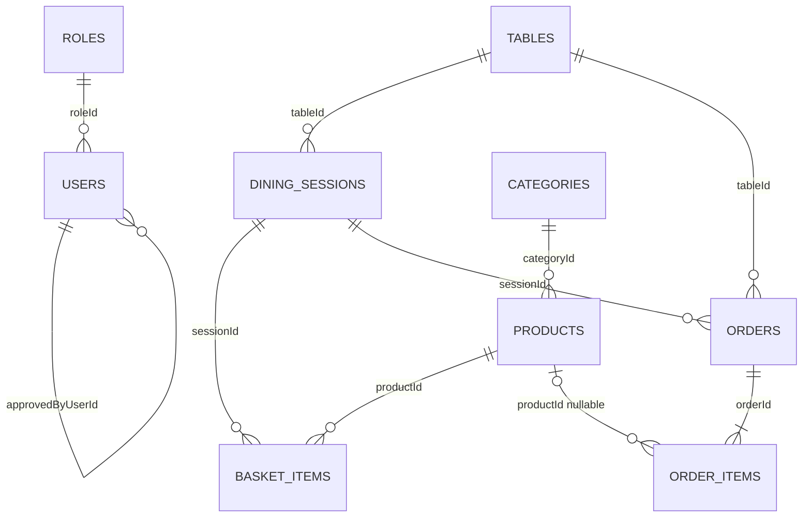

# SmartServe: связи таблиц и кардинальности

Этот документ является источником для DB-диаграммы в IcePanel. Он разделяет уже реализованные связи и целевую модель, чтобы не показывать запланированную таблицу как готовую.

## Обозначения

- `1:N` — одна запись слева связана с несколькими записями справа (`one-to-many`).
- `N:1` — несколько записей слева ссылаются на одну запись справа (`many-to-one`).
- `1:1` — одной записи соответствует одна запись (`one-to-one`).
- `0..1` — связь необязательна: внешний ключ может быть `NULL`.
- `M:N` — многие записи связаны со многими через отдельную junction-таблицу (`many-to-many`).

## Уже реализовано

### `roles 1:N users`

- FK: `users.roleId -> roles.id`.
- TypeORM: `User.role` использует `@ManyToOne(() => Role)`.
- Следовательно, со стороны `Role` это `@OneToMany`.
- `users.roleId` nullable, поэтому один пользователь может временно иметь `0..1` роль, а одна роль — `0..N` пользователей.

### Legacy-ссылки, которые ещё не являются нормальными relations

- `session_profile.userId` хранит UUID последнего вошедшего пользователя, но Entity не объявляет TypeORM relation и FK. Это legacy singleton, а не полноценная `1:1` авторизация.
- `users.approvedByUserId` пока является UUID-колонкой без `@ManyToOne` и FK. В целевой модели это self-reference `users 1:N users`.
- `dining-sessions.tableNumber` является числом, а не FK на таблицу `tables`.
- `basket_store.tables` и `order_store.orders` находятся в JSONB, поэтому реляционных связей с товарами, сессиями и столами сейчас нет.

## Целевая реляционная модель

| Родитель | Связь | Дочерняя таблица | Внешний ключ | Смысл |
|---|---:|---|---|---|
| `roles` | `1:N` | `users` | `users.roleId` | Одна роль назначена многим сотрудникам; роль пользователя nullable до одобрения |
| `users` | `1:N` | `users` | `users.approvedByUserId` | Один руководитель может одобрить много пользователей; одобрение nullable |
| `tables` | `1:N` | `dining_sessions` | `dining_sessions.tableId` | У стола есть история сессий, но одновременно максимум одна открытая |
| `categories` | `1:N` | `products` | `products.categoryId` | Каждый товар обязательно принадлежит одной категории |
| `dining_sessions` | `1:N` | `basket_items` | `basket_items.sessionId` | Одна открытая сессия содержит много позиций корзины |
| `products` | `1:N` | `basket_items` | `basket_items.productId` | Один товар может находиться во многих корзинах |
| `tables` | `1:N` | `orders` | `orders.tableId` | У одного стола может быть много заказов в истории |
| `dining_sessions` | `1:N` | `orders` | `orders.sessionId` | В одной сессии стола может быть создано несколько заказов |
| `orders` | `1:N` | `order_items` | `order_items.orderId` | Один заказ содержит много snapshot-позиций |
| `products` | `1:N` | `order_items` | `order_items.productId` nullable | Один товар встречается во многих заказах; FK nullable для сохранения истории после удаления товара |

## One-to-one

Строгой `1:1` связи между двумя доменными таблицами сейчас нет.

`venue_settings` — singleton-конфигурация: одна установка SmartServe имеет одну строку `venue_settings` с `id = 1`. Это концептуальная связь `SmartServe deployment 1:1 venue_settings`, но deployment не является отдельной таблицей.

`session_profile` нельзя считать правильной `1:1` связью с `users`: это временный singleton последнего вошедшего пользователя, который должен быть удалён.

## Many-to-many

В текущей и зафиксированной целевой модели нет настоящей `M:N` связи.

- `roles.permissions` — JSONB-массив, а не `roles M:N permissions`.
- модификаторы товара пока планируются как JSONB, а не отдельные таблицы.

Если позже permissions или modifiers станут самостоятельными Entity, для `M:N` понадобятся junction-таблицы, например `role_permissions` или `product_modifiers`. До такого решения эти таблицы в архитектуру не добавляются.

## ER-представление целевой модели

